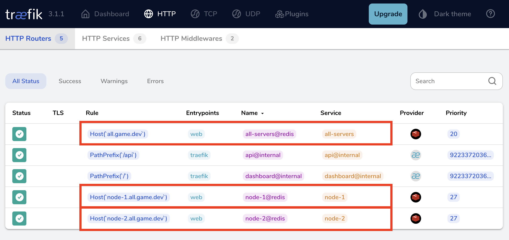

# Load Balancing Colyseus with Traefik



This repository demonstrates how to use Traefik as a load balancer for Colyseus game servers. Each Colyseus server instance is dynamically registered with Traefik using Redis as the configuration provider. This allows for easy scaling and management of game server instances.

**Key features:**

- Dynamic routing with Traefik
- Redis for centralized configuration
- Wildcard DNS for accessing individual server instances
- Server registration and de-registration (e.g., for scaling up and down)

## Prerequisites

- Node.js
- Redis server (_Make sure to have **keyspace notifications** enabled_)
- Traefik
- Wildcard DNS setup (e.g., `*.yourgamedomain.com`)

## Setup

1. Install dependencies:
   ```
   npm install
   ```

2. Configure Traefik.
   - See [traefik-hardcoded.yml](traefik-hardcoded.yml) sample for hardcoded config.
   - See [traefik-redis.yml](traefik-redis.yml) sample for a dynamic config.

3. Start Traefik:
   ```
   traefik --configFile=traefik-redis.yml
   ```

4. Start your Colyseus server(s):
   ```
   PORT=2567 npm start
   PORT=2568 npm start
   PORT=2569 npm start
   ```

## How it works

1. When a Colyseus server starts, it registers itself with Traefik by setting specific keys in Redis.
2. The keys in Redis follow this pattern:
   ```
   traefik/http/routers/${subdomain}/rule
   traefik/http/routers/${subdomain}/service
   traefik/http/services/${subdomain}/loadbalancer/servers/${subdomain}/url
   ```
3. Traefik watches for changes in Redis and updates its routing configuration dynamically.
4. Each server is accessible via its own subdomain (e.g., `server1.yourgamedomain.com`, `server2.yourgamedomain.com`).

## Configuration

Adjust the following variables in your server code:

- `publicAddress`: The public domain for accessing the server
- `port`: The port the Colyseus server is running on

## Scaling

To scale:
1. Start new Colyseus server instances
2. They will automatically register with Traefik via Redis ([See sources](colyseus-app/src/app.config.ts#L31-L54))
3. Traefik will start routing traffic to the new instances

## Notes

- Ensure your wildcard DNS is properly set up to point to the Traefik instance.
- For production use, consider adding security measures like HTTPS, authentication for the Traefik dashboard, and proper Redis security.

## Contributing

Contributions are welcome! Please feel free to submit a Pull Request.

## License

MIT
